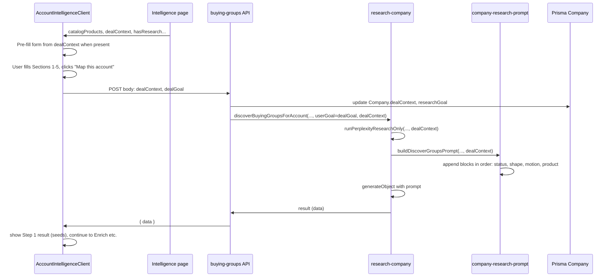

# Account Intelligence form and deal context

## Current state (no conflicts)

**Prisma — Company** ([prisma/schema.prisma](prisma/schema.prisma) ~134–203): Has `researchData` (Json), `researchGoal` (String), `accountIntelligenceCompletedAt` (DateTime?), `draftData` (Json?). No `dealContext`. Safe to add `dealContext Json?` as a new field.

**Prisma — CompanyDepartment** (~588–631): No changes needed; departments are created by apply-research/save-4-step-research. Existing fields (type, customName, useCase, valueProp, targetRoles, segmentType, etc.) stay as-is.

**Intelligence page** ([app/dashboard/companies/[id]/intelligence/page.tsx](app/dashboard/companies/[id]/intelligence/page.tsx)): Loads company (id, name, researchData, researchGoal, accountMessaging, _count.departments). Does not load dealContext or catalog products yet.

**AccountIntelligenceClient** ([app/dashboard/companies/[id]/intelligence/AccountIntelligenceClient.tsx](app/dashboard/companies/[id]/intelligence/AccountIntelligenceClient.tsx)): When `!hasResearch`, shows a single optional textarea "What are you trying to accomplish?" and "Discover buying groups". On Discover it POSTs to `/api/companies/[companyId]/research/buying-groups` with `{ userGoal }` only. Flow: Discover → edit seeds → Enrich → Product fit → Save (POST apply-research with companyBasics, enrichedGroups, researchGoal). No deal-context form today.

**Research prompt** ([lib/research/company-research-prompt.ts](lib/research/company-research-prompt.ts)): `buildDiscoverGroupsPrompt(input)` takes `DiscoverGroupsPromptInput`: companyName, companyDomain, productNames, userGoal. It builds system + user prompt with no account-status, deal-shape, or buying-motion blocks.

**Perplexity / discovery** ([lib/research/research-company.ts](lib/research/research-company.ts)): `runPerplexityResearchOnly` builds a single `researchQuery` from userGoal and product names. `discoverBuyingGroupsForAccount` calls it then `buildDiscoverGroupsPrompt` with product names and userGoal. Products come from CatalogProduct (userId); fallback to Product. No dealContext is read or passed.

**Buying-groups API** ([app/api/companies/[companyId]/research/buying-groups/route.ts](app/api/companies/[companyId]/research/buying-groups/route.ts)): POST body: `userGoal` only. Calls `discoverBuyingGroupsForAccount(companyName, domain, userId, userGoal)`. Does not persist anything to Company except indirectly via later apply-research.

**Apply-research** ([app/api/companies/[companyId]/apply-research/route.ts](app/api/companies/[companyId]/apply-research/route.ts)): Accepts 4-step payload (companyBasics, enrichedGroups, researchGoal). Updates Company (name, website, industry, employees, headquarters, revenue, researchGoal, researchData). Does not read or write dealContext.

---

## 1. Schema and types

**Prisma**  

- In [prisma/schema.prisma](prisma/schema.prisma), on `Company`, add: `dealContext Json?` (no default, or `@default("{}")` if you want). No other model changes.

**TypeScript**  

- Add [lib/types/deal-context.ts](lib/types/deal-context.ts) with:
  - `DealContext` type matching the spec (productIds, accountStatus, deployedLocation, deployedUseCase, hasProvenOutcomes, relationshipLocation, dealShape, targetDivisions, buyingMotion, committeeName, dealGoal).
  - `parseDealContext(raw: unknown): DealContext` for reading from Prisma Json.

---

## 2. Intelligence page data and form (UI)

**Server page** [app/dashboard/companies/[id]/intelligence/page.tsx](app/dashboard/companies/[id]/intelligence/page.tsx):  

- Fetch `dealContext` and catalog products for the user:
  - `company.dealContext` (after adding the field).
  - `prisma.catalogProduct.findMany({ where: { userId }, select: { id: true, name: true, slug: true }, orderBy: { name: 'asc' } })`.
- Pass to client: `dealContext` (parsed via parseDealContext), `catalogProducts` (array of { id, name, slug }), and existing props. If the app has a dedicated "company data" products page, use that for the "Add your products first" link; otherwise use `/dashboard/content-library` (current "Your company data" surface).

**AccountIntelligenceClient**  

- **When dealContext already exists on load:** Pre-fill the form from existing `dealContext` when present. Do **not** skip the form — the rep may want to change deal shape or products and re-run discovery. The page passes `dealContext` to the client; the client must set it as **initial form state** (e.g. via the same shape as DealContext / parseDealContext). No separate "skip form" path.
- **Before** "Discover buying groups" (when `!hasResearch`), render the new form (Sections 1–5) so deal context is collected first.
  - **Section 1 — What are you selling?** Multi-select checkboxes from `catalogProducts`; field `selectedProductIds: string[]`; required (at least one); store as `dealContext.productIds`. If `catalogProducts.length === 0`, show "Add your products first →" linking to `/dashboard/content-library` (or `/dashboard/company-data` if that route exists) and block Discover.
  - **Section 2 — Are you already in this account?** Radio `accountStatus` (new, existing_deployed, existing_relationship, stalled, champion_in). Conditional: if `existing_deployed`, show deployedLocation (text), deployedUseCase (textarea), hasProvenOutcomes (radio yes/no). If `existing_relationship`, show relationshipLocation (text).
  - **Section 3 — How does your product land here?** Radio `dealShape` (single_team, multi_department, multi_division, unknown). Conditional: if `multi_division`, show **targetDivisions** — **minimum 0 (fully optional), maximum 6 entries**. When the list is empty, the prompt uses the "discover it" variant of the multi_division block. **Each entry is a single text input with an "Add another" button**; do not use a comma-separated field, because division names can contain commas (e.g. "Autonomous Vehicle, Safety & Testing").
  - **Section 4 — How does buying work here?** Radio `buyingMotion` (standard, committee, regulated, unknown). Conditional: if `committee`, show committeeName (text).
  - **Section 5 — Goal (optional):** Single textarea `dealGoal`. **This replaces the old "What are you trying to accomplish?" textarea entirely.** There is only one goal field in the UI; the old standalone userGoal textarea is removed. Section 5 is its replacement.
- **Submit:** Primary CTA "Map this account →" with subtext "~30 seconds. You'll review before anything saves."
  - On submit: validate (at least one product selected; accountStatus and dealShape and buyingMotion required). **Option B:** POST to buying-groups with body `{ dealContext, dealGoal }`. The buying-groups route persists `dealContext` to Company, sets `researchGoal` from `dealGoal` when present, and uses `dealGoal` as `userGoal` for `discoverBuyingGroupsForAccount`. One request saves context and runs discovery. Do not keep two goal fields (dealGoal and userGoal) in the UI — only dealGoal.

---

## 3. Persisting dealContext

**POST /api/companies/[companyId]/research/buying-groups** ([app/api/companies/[companyId]/research/buying-groups/route.ts](app/api/companies/[companyId]/research/buying-groups/route.ts)):  

- Parse body: `dealContext` (object), `dealGoal` (string, optional). **When `dealGoal` is present, use it as `userGoal`** when calling `discoverBuyingGroupsForAccount`; do not read a separate `userGoal` from the body. Validate `dealContext` with a shallow schema or parseDealContext.
- Before calling `discoverBuyingGroupsForAccount`:
  - `prisma.company.update({ where: { id: companyId, userId }, data: { dealContext: dealContext ?? undefined, researchGoal: dealGoal?.trim() || undefined } })`.
  - Set `userGoal = dealGoal?.trim() || undefined` for the discovery call.
- Call `discoverBuyingGroupsForAccount(..., userGoal, dealContext)` (extend signature below).

**Apply-research** ([app/api/companies/[companyId]/apply-research/route.ts](app/api/companies/[companyId]/apply-research/route.ts)):  

- When saving 4-step result, do **not** overwrite `dealContext` (it was already set at Discover time). Safest is to leave dealContext as set by buying-groups.

---

## 4. Injecting dealContext into the research prompt

**Prompt builder** ([lib/research/company-research-prompt.ts](lib/research/company-research-prompt.ts)):  

- Extend `DiscoverGroupsPromptInput` with `dealContext?: DealContext` and `companyName?: string` (for template substitution in blocks).
- In `buildDiscoverGroupsPrompt`, append **conditional blocks in this exact order**. Order matters: if deal shape comes before account status, the model can anchor on structure before strategic context; for existing_deployed, the "do not surface the already-deployed team" instruction can be ignored if the model has already decided on divisions (e.g. NVIDIA/GM case). Implement in this sequence:
  1. **Account status block first** (sets primary research objective):
    - If `accountStatus === 'existing_deployed'`: EXISTING DEPLOYMENT CONTEXT block (deployedLocation, deployedUseCase, hasProvenOutcomes, primary research objective, "Do NOT surface the already-deployed team").
    - If `accountStatus === 'stalled'`: "Previously active, now stalled" block (research focus: what changed in last 90 days; re-entry points).
    - If `accountStatus === 'champion_in'`: "Champion exists, need economic buyer" block (approval chain, committee, champion enablement as primary).
  2. **Deal shape block second** (sets output structure):
    - If `dealShape === 'multi_division'`: DEAL SHAPE multi-division block (targetDivisions if any; per-division output shape; when targetDivisions is empty use the "discover it" variant).
    - If `dealShape === 'single_team'`: single-team stakeholder map block (functional map, 4–5 groups).
    - If `dealShape === 'multi_department'`: multi-department block (3–5 departments, distinct use cases).
  3. **Buying motion block third** (adds stakeholder types to each group):
    - If `buyingMotion === 'committee'`: committee block (committeeName if set; committee members as separate buying group).
    - If `buyingMotion === 'regulated'`: regulated block (compliance/legal as first-class stakeholders).
  4. **Product context last:** filtered product names (and use cases if needed) from dealContext.productIds.
- Use the exact wording from the spec for each block; substitute `{companyName}`, `{deployedLocation}`, etc., from dealContext and company name.
- **Product selection:** With dealContext.productIds, restrict to selected products when building productNames for the prompt. If productIds is empty or missing, keep current behavior (all products).

**Perplexity query** ([lib/research/research-company.ts](lib/research/research-company.ts)):  

- `runPerplexityResearchOnly` currently builds one `researchQuery` from userGoal and product names. Extend it to accept optional `dealContext`. When `dealContext.accountStatus === 'stalled'`, add to the query: focus on changes in last 90 days (exec changes, initiatives, funding, product launches). When `champion_in`, add: focus on approval chain and decision-makers above the champion. When `existing_deployed`, add: focus on other divisions/departments with adjacent use cases (and optionally mention "exclude already-deployed area"). This keeps Perplexity aligned with the same deal context the LLM sees.

**Discovery entrypoint** ([lib/research/research-company.ts](lib/research/research-company.ts) — `discoverBuyingGroupsForAccount`):  

- Add parameter `dealContext?: DealContext`. Pass it to `runPerplexityResearchOnly` and to `buildDiscoverGroupsPrompt`. Use dealContext.productIds to filter catalog products to those IDs when building productNames for the prompt (if productIds is present and non-empty).

---

## 5. Flow summary

---

## 6. File-level checklist

| Area     | File                                                                                                                                               | Change                                                                                                                                                                                                                                                                    |
| -------- | -------------------------------------------------------------------------------------------------------------------------------------------------- | ------------------------------------------------------------------------------------------------------------------------------------------------------------------------------------------------------------------------------------------------------------------------- |
| Schema   | [prisma/schema.prisma](prisma/schema.prisma)                                                                                                       | Add `dealContext Json?` on Company. Run migration.                                                                                                                                                                                                                        |
| Types    | New `lib/types/deal-context.ts`                                                                                                                    | Add DealContext type and parseDealContext.                                                                                                                                                                                                                                |
| Page     | [app/dashboard/companies/[id]/intelligence/page.tsx](app/dashboard/companies/[id]/intelligence/page.tsx)                                           | Fetch dealContext and catalogProducts; pass to client.                                                                                                                                                                                                                    |
| Form UI  | [app/dashboard/companies/[id]/intelligence/AccountIntelligenceClient.tsx](app/dashboard/companies/[id]/intelligence/AccountIntelligenceClient.tsx) | Add Sections 1–5 form; initial state from dealContext when present; targetDivisions = single inputs + "Add another" (max 6); submit dealContext + dealGoal to buying-groups in one POST; remove old userGoal textarea.                                                    |
| API      | [app/api/companies/[companyId]/research/buying-groups/route.ts](app/api/companies/[companyId]/research/buying-groups/route.ts)                     | Accept dealContext and dealGoal in body; use dealGoal as userGoal for discovery; persist dealContext and researchGoal to Company; pass dealContext and filtered products into discovery.                                                                                  |
| Prompt   | [lib/research/company-research-prompt.ts](lib/research/company-research-prompt.ts)                                                                 | Extend input with dealContext/companyName; in buildDiscoverGroupsPrompt append blocks in exact order: (1) account status, (2) deal shape, (3) buying motion, (4) product context.                                                                                         |
| Research | [lib/research/research-company.ts](lib/research/research-company.ts)                                                                               | runPerplexityResearchOnly: accept optional dealContext; adjust researchQuery for stalled/champion_in/existing_deployed. discoverBuyingGroupsForAccount: accept dealContext; filter products by dealContext.productIds; pass dealContext to prompt builder and Perplexity. |

---

## 7. Product link and load behavior

- **"Add your products first"** link: Use `/dashboard/content-library` (products/catalog live there) unless a dedicated `/dashboard/company-data` route exists.
- **Load when dealContext exists:** Pre-fill the form from `dealContext` when the page loads with existing data. Do not skip the form; the client sets initial form state from the `dealContext` prop (parsed via parseDealContext or equivalent). Rep can edit and re-run discovery.
- **draftData (optional follow-up):** Optionally auto-save the form into `draftData` on blur or interval; on load, prefill from `dealContext ?? draftData`.

---

## 8. Order of implementation

1. Add `dealContext` to Prisma Company and create migration; add [lib/types/deal-context.ts](lib/types/deal-context.ts).
2. Extend buying-groups API to accept `dealContext` and `dealGoal`; use dealGoal as userGoal; persist dealContext and researchGoal to Company; pass dealContext into discovery.
3. Add catalog products and dealContext fetch to intelligence page; pass to client.
4. Build the 5-section form in AccountIntelligenceClient: initial state from dealContext; targetDivisions as single text inputs + "Add another" (min 0, max 6); Section 5 as the only goal field (dealGoal); remove old textarea; on "Map this account" submit dealContext + dealGoal in one POST to buying-groups; keep existing Discover → Enrich → Product fit → Save flow after that.
5. Extend buildDiscoverGroupsPrompt with dealContext and conditional blocks in the specified order (account status → deal shape → buying motion → product context); extend runPerplexityResearchOnly and discoverBuyingGroupsForAccount to accept and use dealContext and productIds filter.

