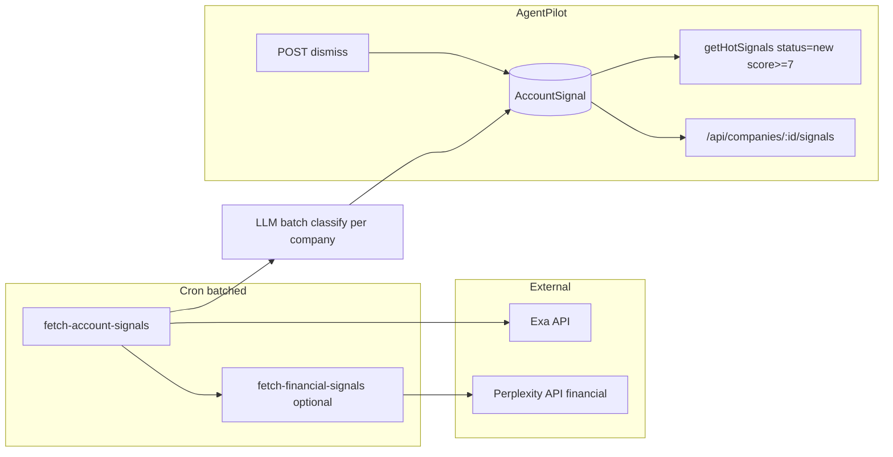

# Exa + Perplexity for realtime account signals (revised)

## Context

- **Firecrawl**: URL-based crawl for *your* content library. Unchanged.
- **Exa**: Semantic search over the live web with date filters. Used for news, executive changes, product launches, funding.
- **Perplexity**: Existing research + new **financial** usage (earnings, SEC, recency/domain filters).
- **Hot signals**: Today built only from CampaignVisit + Activity + one content-library item. This plan adds external account events via `AccountSignal`.

## Architecture




---

## 1. Prisma: AccountSignal and indexes

- **Model** `AccountSignal`: id, companyId, userId, type, title, summary, url, publishedAt, relevanceScore, suggestedPlay, status ('new' | 'seen' | 'acted'), createdAt.
- **Relations**: Company has AccountSignal[]; ensure userId on AccountSignal for dashboard queries.
- **Indexes** (all required for performance):
  - `@@index([companyId, publishedAt])`
  - `@@index([userId, status, relevanceScore])`
  - `@@index([companyId, url])` — for dedup on insert (findFirst by companyId + url).
  - `@@index([companyId, publishedAt, type])` — for type-based cross-run dedup (e.g. skip new earnings_call if one exists in last 7 days).

---

## 2. Exa fetcher: batch LLM classification

**File:** `lib/signals/fetch-account-signals.ts`

- **One LLM call per company:** Pass all Exa results for that company in a **single** `generateObject` with schema `z.object({ signals: z.array(signalSchema) })`. Do **not** call the LLM per result — that would be 150+ calls per cron run for 10 companies × 15 results.
- **publishedAt fallback:** Exa's `publishedDate` is often missing. When missing, set `publishedAt = new Date()` (cron run time) so signals still pass `publishedAt: { gte: fortyEightHoursAgo }` and surface in the dashboard. Document this in a one-line comment in the fetcher.
- Save threshold: persist all signals with **relevanceScore >= 5**. The dashboard and Hot Signals then filter by **score >= 7** and **status === 'new'**. Storing 5–6 gives flexibility for the company Activity tab (which can show lower scores or no score filter) and future tuning without re-fetching.

---

## 3. Cron: batching, rate limits, dedup

**File:** `app/api/cron/fetch-account-signals/route.ts`

- **Rate limiting:** Process companies in **batches of 5** (or 3 for conservative Exa limits). Between batches, `await sleep(1000)`. Do not fire all companies in parallel — specify this in the spec:

```ts
  for (let i = 0; i < companies.length; i += BATCH_SIZE) {
    const batch = companies.slice(i, i + BATCH_SIZE);
    await Promise.all(batch.map(company => processCompany(company)));
    if (i + BATCH_SIZE < companies.length) await new Promise(r => setTimeout(r, 1000));
  }
  

```

- **Dedup on insert:** (companyId, url) — `findFirst` where companyId + url before create. Use the `@@index([companyId, url])` for this query.
- **Cross-run dedup (same event, multiple URLs):** The same event (e.g. GM earnings) can appear on SEC, SeekingAlpha, Reuters, etc. — different URLs, so (companyId, url) does not dedupe. Add **type-based dedup** before saving:
  - For `earnings_call` (and optionally `acquisition`): if a signal with that type already exists for the company in the **last 7 days**, skip saving a new one.
  - Other types (product_announcement, executive_hire, industry_news) can use a shorter window or no cross-run dedup in v1; document the choice. At minimum, add the index `@@index([companyId, publishedAt, type])` and implement the 7-day check for `earnings_call`.

---

## 4. Status lifecycle and dismiss

- **Problem:** Signals are created with `status: 'new'`. Nothing in the plan changes them to `'seen'` or `'acted'`, so the same items stay in Hot Signals until they age out of the 48h window.
- **Fix:** Add **POST /api/signals/[signalId]/dismiss** (or PATCH with body `{ status: 'seen' | 'acted' }`). The Hot Signals UI calls this when the rep acknowledges or acts (e.g. "Run play" or "Dismiss"). After dismiss, the signal no longer appears in Hot Signals (which filters `status: 'new'`).
- **Intentional inconsistency:** Hot Signals query uses `status: 'new'`. The **company signals API** (`/api/companies/[companyId]/signals`) does **not** filter by status — the Activity tab shows all signals for that company including already-seen/acted. That is intentional: Activity is a timeline; Hot Signals is an actionable inbox.

---

## 5. Dashboard Hot Signals and company signals API

- **getHotSignals:** Query AccountSignal with `userId`, `status: 'new'`, `relevanceScore: { gte: 7 }`, `publishedAt: { gte: fortyEightHoursAgo }`. Map to existing HotSignal shape; merge with existing visit/activity/feature-release signals; sort by date; return top 10.
- **Company signals API:** Query AccountSignal for that company within the requested `days`; **no status filter** (show all). Map to existing Signal interface using **named constants** for tier mapping:
  - Define e.g. `RELEVANCE_TIER_1_MIN = 8`, `RELEVANCE_TIER_2_MIN = 6` in a small shared module (e.g. `lib/signals/constants.ts`). Tier 1: score >= 8, Tier 2: score >= 6, else Tier 3. Use these constants in the API and anywhere else that maps relevanceScore to tier so magic numbers are not repeated.

---

## 6. Perplexity financial and env

- **fetch-financial-signals.ts:** Perplexity with `search_domain_filter` and `search_recency_filter` for earnings/SEC. Optional ticker on Company later.
- **.env.example:** `EXA_API_KEY`; optional note in service-config for Exa status.

---

## 7. "What happened at X today?" in chat (near-term)

- **Promote from optional:** Once the cron and AccountSignal exist, this is the feature the Sales VP asked for by name. Reuse `fetchAccountSignals(companyName, domain, industry, lookbackHours)` on demand when the rep asks "What happened at [Company] today?" (or similar). Return formatted list (earnings, executive, product, etc.) in the chat response. Implementation is short (~30 min) and does not require MCP — same server-side fetch used by the cron.

---

## Implementation order (unchanged)

1. Prisma: AccountSignal + indexes (including companyId+url, companyId+publishedAt+type).
2. Exa fetcher with **batch** LLM classification and publishedAt fallback.
3. Cron route with company **batching and delay**, (companyId, url) dedup, and type-based dedup for earnings_call.
4. Dismiss endpoint; wire Hot Signals (and optionally company tab) to call it.
5. Merge AccountSignal into getHotSignals and company signals API using RELEVANCE_TIER_* constants.
6. Perplexity financial module; optional cron integration.
7. Chat: on-demand "What happened at X today?" using fetchAccountSignals.

---

## Files to add


| Path                                          | Purpose                                                               |
| --------------------------------------------- | --------------------------------------------------------------------- |
| `lib/signals/constants.ts`                    | RELEVANCE_TIER_1_MIN, RELEVANCE_TIER_2_MIN (and any score thresholds) |
| `lib/signals/fetch-account-signals.ts`        | Exa + **one** generateObject per company, publishedAt fallback        |
| `lib/signals/fetch-financial-signals.ts`      | Perplexity financial (earnings/SEC)                                   |
| `app/api/cron/fetch-account-signals/route.ts` | Batched cron, dedup, type-based skip                                  |
| `app/api/signals/[signalId]/dismiss/route.ts` | POST/PATCH to set status to seen/acted                                |


## Files to change


| Path                                             | Change                                                              |
| ------------------------------------------------ | ------------------------------------------------------------------- |
| `prisma/schema.prisma`                           | AccountSignal, indexes as above                                     |
| `lib/dashboard/hot-signals.ts`                   | AccountSignal query (status new, score >= 7), merge, tier constants |
| `app/api/companies/[companyId]/signals/route.ts` | AccountSignal query (no status filter), tier constants              |
| `vercel.json`                                    | Cron for fetch-account-signals                                      |
| `.env.example`                                   | EXA_API_KEY                                                         |
| Chat route / tools                               | On-demand "What happened at X?" calling fetchAccountSignals         |


Firecrawl and content-library cron remain unchanged.