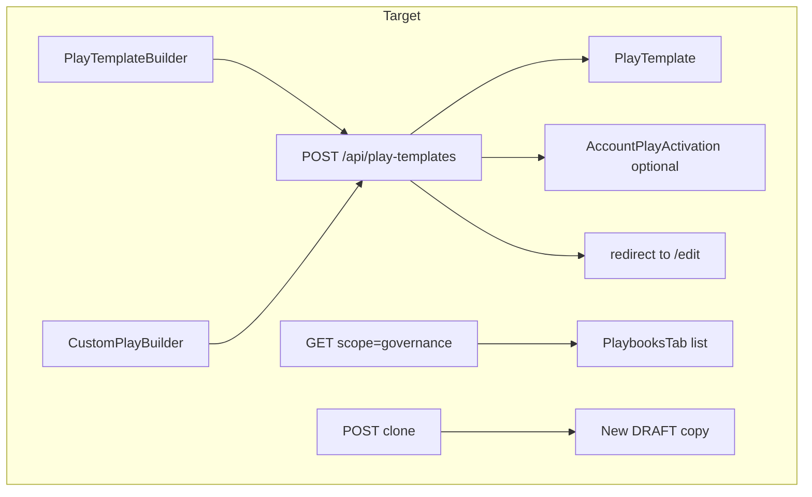

# PlayTemplateBuilder, APIs, and entry points

## Design review (feedback incorporated)

**Validated as solid (unchanged core):**

- **Single `$transaction`** for `PlayTemplate` + `PlayPhaseTemplate` + `ContentTemplate` — avoids orphaned phases; keep.
- **Slug generation** with per-user uniqueness and numeric suffix on conflict — keep.
- **Zod** for cross-field rules (timeline fields only if `TIMELINE`, etc.) — keep.
- **PUT run-safety:** structural edits only when `_count.runs === 0`; else header-only + **409** with actionable copy — keep; versioning remains a future effort.
- `**GET ?scope=governance`** — one query param, catalog unchanged — keep.
- `**uiPhaseKind` in `gateConfig`** — pragmatic, no migration — keep.

**Adjustments added to this plan:**

| Topic                            | Change                                                                                                                                                                                                                                                                                                                                                                                                                                                                                                                                                                                  |
| -------------------------------- | --------------------------------------------------------------------------------------------------------------------------------------------------------------------------------------------------------------------------------------------------------------------------------------------------------------------------------------------------------------------------------------------------------------------------------------------------------------------------------------------------------------------------------------------------------------------------------------- |
| **Account context on publish**   | **Default:** when `POST` succeeds with `status: ACTIVE` and request includes `companyId`, **auto-create** (upsert) `AccountPlayActivation` for that template + company’s roadmap so the catalog-with-company filter shows the play immediately. **UI:** checkbox **“Activate for [company name]”** default **on** when `companyId` is present; send `activateForCompany: false` to opt out. Server: if no roadmap exists for company, return **400** with clear message or optionally skip activation (product choice — prefer explicit error so AE knows why activation didn’t apply). |
| `**promptTemplate` vs hint**     | **Simple mode:** user enters a short hint → persist `promptTemplate` as scaffold: `{{userInstructions}}\n\nAdditional guidance:\n[hint]`. **Advanced mode:** raw textarea = stored **as-is** (full prompt). **Heuristic (optional):** if input contains `{{` or exceeds N lines/chars, treat as full prompt. UI: toggle **Advanced** reveals full template editor.                                                                                                                                                                                                                      |
| **Phase/step UI (v1)**           | **Enforce 1:1** in the builder: each **phase row** = one `PlayPhaseTemplate` + exactly one `ContentTemplate`. Data model still allows multiple content rows per phase (seeds, future); API accepts an array with `steps: [single]` for builder-created payloads, or validate `steps.length === 1` for `source: 'builder_v1'`. Drag-and-drop **only between phases** (reorder sequence), not nested step lists.                                                                                                                                                                          |
| **CustomPlayBuilder after POST** | On successful `POST` with `DRAFT`, `**router.push`** to `**/dashboard/my-company/play-templates/[id]/edit`** (not toast-only) so review/publish happens in `PlayTemplateBuilder`.                                                                                                                                                                                                                                                                                                                                                                                                       |
| **Clone API**                    | Add `**POST /api/play-templates/[id]/clone`**: copy template + phases + content templates with new ids, name `**[Original] (copy)`**, slug derived with conflict suffix, `**status: DRAFT**`, no runs. Makes **409** “duplicate as new” flow real.                                                                                                                                                                                                                                                                                                                                      |
| **Implementation order**         | Reordered so **POST + builder ship together** for immediate E2E test; **governance GET** after PlaybooksTab shell; **PUT + clone** before **DELETE**; catalog/AI/My Day last. See §8.                                                                                                                                                                                                                                                                                                                                                                                                   |

---

## Current state (verified)

- `**[PlayTemplate](prisma/schema.prisma)`** already has `status` (`DRAFT` | `ACTIVE` | `ARCHIVED`), `scope`, `category`, `triggerType`, `defaultAutonomyLevel`, `signalTypes[]`, optional timeline fields, and `@@unique([userId, slug])`.
- **Nested model**: `PlayPhaseTemplate` → **multiple** `[ContentTemplate](prisma/schema.prisma)` per phase (builder v1 still creates one per phase).
- `**[GET /api/play-templates](app/api/play-templates/route.ts)`** returns **only `ACTIVE`**; with `?companyId=` filters by **AccountPlayActivation**. Drafts invisible in `**[PlaybooksTab](app/dashboard/my-company/tabs/PlaybooksTab.tsx)`** today.
- `**[PATCH /api/play-templates/[id]](app/api/play-templates/[id]/route.ts)`** only updates `defaultAutonomyLevel`.
- `**[CustomPlayBuilder](app/components/plays/CustomPlayBuilder.tsx)**` is unused; manual create wrongly uses first catalog template + `**POST /api/play-runs**`.

---

## 1. API contract: `POST /api/play-templates`

**Purpose:** Create `PlayTemplate` + phases + content templates in **one `$transaction`**.

**Auth:** Session `userId` on template and every `ContentTemplate`.

**Additional request fields:**

| Field                | Type     | Notes                                                                                            |
| -------------------- | -------- | ------------------------------------------------------------------------------------------------ |
| `companyId`          | string?  | When user creates from catalog with account context                                              |
| `activateForCompany` | boolean? | Default `**true`** when `companyId` set **and** `status === ACTIVE`; if `false`, skip activation |
| `source`             | string?  | Optional; e.g. `builder_v1` to enforce `steps.length === 1` server-side if desired               |

**Post-transaction (same request, not nested in DB transaction):** If `status === ACTIVE` && `companyId` && `activateForCompany !== false`:

1. Resolve `adaptiveRoadmap` for `{ userId, companyId }`.
2. If missing roadmap → **400** `No strategic account plan for this company; activation skipped or blocked` (pick one policy and document).
3. Else `**upsert` `AccountPlayActivation`** (`roadmapId`, `playTemplateId`, `isActive: true`, preserve existing `customConfig` if re-activating).

**Phase / step payload (builder v1):** Each phase includes `steps: [ exactly one step object ]` OR flatten API to a single `step` per phase — Zod should enforce one content template per phase for requests tagged as builder.

`**promptTemplate` resolution (server-side helper):**

- If client sends `promptMode: 'advanced'` **or** `rawPromptTemplate` set → use `rawPromptTemplate` as `ContentTemplate.promptTemplate`.
- Else client sends `promptHint` → set `promptTemplate` to scaffold above.
- If client sends both, prefer explicit `rawPromptTemplate` when `promptMode === 'advanced'`.

(Alternatively single field `promptTemplate` from client with mode flag only — same rules.)

**Response:** `{ template: { id, slug, status, ... }, phases: [...] }`.

**Errors:** `400` validation / no roadmap for activation; `401`; `409` slug conflict.

---

## 2. API contract: `POST /api/play-templates/[id]/clone`

**Purpose:** Duplicate template for the **409 / iterate** flow.

**Behavior:**

1. `findFirst` template `{ id, userId }` with full `phases` + `contentTemplates` (ordered).
2. New slug from `slugify(name) + '-copy'` or name-based copy pattern; suffix until unique.
3. `$transaction`: create `PlayTemplate` (`name` = `[Original name] (copy)`, `status: DRAFT`), recreate phases (`orderIndex`, `name`, `description`, `offsetDays`, `gateType`, `gateConfig` copy), recreate each `ContentTemplate` with same fields except new ids and `userId`.
4. Return same shape as POST create.

**Auth:** 404 if not owner.

---

## 3. API contract: `PUT /api/play-templates/[id]`

Same as prior plan:

- **No runs:** full structural replace (delete/recreate children in FK-safe order, or delete phases after clearing references — validate against `PlayAction` FKs).
- **Has runs:** header-only (`name`, `description`, `defaultAutonomyLevel`, `status` transitions); **409** on body containing phase/step mutations.

**409 response body:** `{ error, code: 'STRUCTURAL_EDIT_BLOCKED', suggestion: 'clone' }` with client linking to **Clone** action calling `**POST .../clone`**.

---

## 4. API contract: `DELETE /api/play-templates/[id]`

Soft archive: `status: ARCHIVED`. Guard active runs with **409** unless `?force=1` after confirm.

---

## 5. GET extensions for governance

- `**?scope=governance`:** return templates for `userId` where `status IN (DRAFT, ACTIVE, ARCHIVED)` (exclude archived from default list **or** include with filter toggle — recommend **include ARCHIVED** collapsed or filter chip).
- **Catalog `GET`:** unchanged (`ACTIVE` only; optional `companyId` activation filter).
- `**GET [id]`:** return full editor payload: phase `gateConfig`, each content template `promptTemplate`, `contentGenerationType`, toggles, `systemInstructions`, etc.

---

## 6. `PlayTemplateBuilder` component spec

**v1 structure:**

1. **Header** — same as before (name, description, category, trigger, timeline, scope, default autonomy, Save draft / Publish).
2. **Sequential phases (1:1)** — list of **phase cards**; each card contains:
  - Phase: name, description, offset days, `uiPhaseKind`, optional gate (collapsed).
  - **Single step:** name, content type, content generation type, channel, requires contact, automatable, **Simple** hint textarea **or** **Advanced** full `promptTemplate` editor.
3. **Reorder** — drag entire phase cards only (no inner step list).
4. **Validation** — ≥1 phase; each phase has non-empty step name + contentType + (hint or advanced prompt).
5. **Account banner** — when `context.companyId` set: show **“Activate for [Company]”** checked by default; maps to `activateForCompany`.

**Persistence:** `POST` create / `PUT` edit; on **409** offer button **“Duplicate as new template”** → `POST .../clone` from current id then navigate to edit copy.

---

## 7. Entry points

| Location                                                             | Change                                                                                                                                                                                                                                    |
| -------------------------------------------------------------------- | ----------------------------------------------------------------------------------------------------------------------------------------------------------------------------------------------------------------------------------------- |
| `**[PlaybooksTab](app/dashboard/my-company/tabs/PlaybooksTab.tsx)`** | **+ Create Template** → `/dashboard/my-company/play-templates/new`. **Edit** → `/dashboard/my-company/play-templates/[id]/edit`. Status badges once governance GET lands (step 4); until then, list remains ACTIVE-only from current GET. |
| `**[PlayCatalog](app/components/plays/PlayCatalog.tsx)`**            | **+ Create play** → builder with `companyId` from URL + `returnTo`.                                                                                                                                                                       |
| `**[MyDayDashboard](app/components/dashboard/MyDayDashboard.tsx)`**  | **+ New Play** → `/dashboard/plays` or `?create=1` (last milestone).                                                                                                                                                                      |

---

## 8. CustomPlayBuilder convergence

- Map AI / manual steps → **POST** payload with **one phase per step** (N phases, each `steps: [one]`).
- Default `**status: DRAFT`**; optional **Publish immediately** checkbox for power users.
- After `**POST` success** → `**router.push(`/dashboard/my-company/play-templates/${id}/edit`)`**.
- Remove broken **first-template `POST /api/play-runs`** manual path.

---

## 9. Implementation order (revised)

1. **Shared types + Zod + `POST /api/play-templates`** (+ transaction helper, slug, prompt scaffold, optional activation after commit).
2. `**PlayTemplateBuilder` + routes** `/dashboard/my-company/play-templates/new` and `/[id]/edit` — **test E2E create against POST** immediately.
3. **PlaybooksTab:** **+ Create Template**, **Edit** links, badges (initially only **ACTIVE** visible until step 4).
4. `**GET ?scope=governance` + enrich `GET [id]`** — drafts/archived in list; wire `fetch` in PlaybooksTab.
5. `**PUT` with run-safety + `POST /api/play-templates/[id]/clone`**.
6. `**DELETE` soft-archive** with run guard.
7. **Play Catalog** entry + **CustomPlayBuilder** (POST DRAFT → redirect edit) + optional AI entry.
8. **My Day** rewire to `/dashboard/plays`.

---

## 10. Testing (manual)

- Create template → Publish with company context → **activation** exists → catalog with `?companyId=` shows template **without** separate SAP activation.
- Opt-out checkbox → publish ACTIVE but **no** new activation (or verify skip).
- Simple hint → stored scaffold; Advanced → verbatim.
- Clone → DRAFT copy, editable; 409 on structural PUT → clone → edit copy succeeds.
- CustomPlayBuilder → DRAFT POST → lands on **edit** page.
- Slug collision on clone/create.

---

## Explicit non-goals

- **Template versioning** for in-flight runs (future).
- **PlayCategory** enum expansion without migration.
- **Multi-step-per-phase** in builder UI (data model still supports multiples for seeds).

