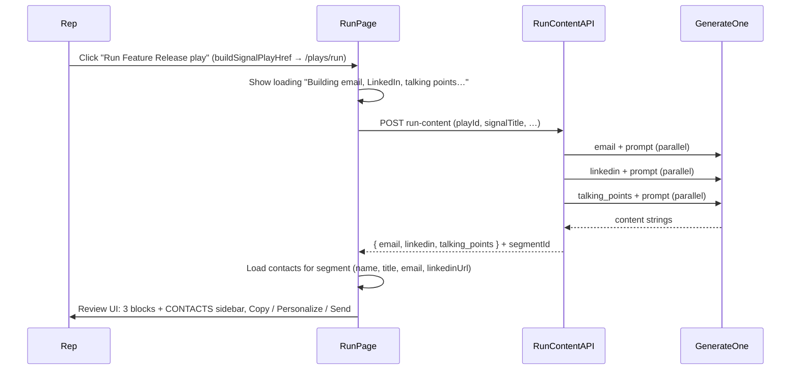

# Option B: Signal → Run → Review → Outreach (full flow)

## Goal

When the rep clicks **"Run [play]"**, they land on a **dedicated run page** that:

1. Generates **email**, **LinkedIn**, and **talking points** in parallel (~3–10 s).
2. Shows a **review screen** with three content blocks plus **buying group contacts** (name, title, LinkedIn URL, email) so the rep sees exactly who the content is for.
3. Supports **per-contact personalization** (one-click), **outreach execution** (send email, copy LinkedIn + open profile, schedule meeting), and **activity logging** so the loop closes (last activity → Re-Engagement play).




---

## 1. New page: play run (loading + review UI)

**Path:** [app/dashboard/companies/[id]/plays/run/page.tsx](app/dashboard/companies/[id]/plays/run/page.tsx) (server) + client component for the run/review flow.

**URL (same params as today’s create-content from buildSignalPlayHref):**

- `playId`, `signalTitle`, `signalSummary?`, `segmentId?`, `segmentName?`
- Optional: `signalId` — when present, run page (or API) fetches [AccountSignal](prisma/schema.prisma) server-side and derives title, summary, playId, companyId, segmentId so the client doesn’t need to pass them.

**Server page:**

- Auth, load company by `[id]`, verify `userId`. Pass `companyId`, `companyName`, and searchParams (or parsed run params) to client. Optionally resolve `signalId` server-side and pass a single `runParams` object.

**Client component (e.g. `PlayRunClient`):**

- On mount: read `playId`, `signalTitle`, … (or `signalId`). If any required param is missing, show error or redirect.
- Call **POST** `/api/companies/[companyId]/plays/run-content` with body: `{ playId, signalTitle?, signalSummary?, segmentId?, segmentName? }` or `{ signalId }`.
- **Loading state:** e.g. "Building email, LinkedIn, and talking points…" with a simple spinner/skeleton (~3–10 s).
- **Success:** Store `{ email, linkedin, talking_points }` in state and render the **review UI**.
- **Error:** Show error message; optional "Try again" that re-calls the API.

**Review UI:**

- Three sections: **Email**, **LinkedIn**, **Talking points**.
- Each section:
  - Renders the generated content (email: e.g. "Subject: ..." + body; LinkedIn and talking points: plain text).
  - **Copy** button: copy that block to clipboard.
  - **Edit** button: navigate to existing create-content page with:
    - Same query params (`playId`, `signalTitle`, `signalSummary`, `segmentName`, `segmentId`) so prompt is pre-filled,
    - Pre-selected content type (email / linkedin / talking_points),
    - Optional: pass generated content as initial value (e.g. hash or sessionStorage) so create-content can show "Edit this draft"; if that’s not implemented in create-content yet, "Edit" can just open create-content with type + prompt pre-filled.
- **Contacts section (sidebar or below):** Show buying group contacts: **name**, **title**, **email**, **LinkedIn URL** per contact. Load contacts for the segment (`segmentId`) via company/contacts API. Sidebar on desktop or section below on mobile. Per-contact actions (Phase 2/3): Personalize, Send, Open LinkedIn, Schedule. See "What makes the OMG moment" below.
- No chat, no prompt box. Optional footer CTA: "Back to company" or "Create landing page".

**Edge cases:**

- Company has no Account Intelligence: API will fail or return weak content; show same "Complete Account Intelligence first" style message as create-content and link to intelligence page.
- Partial failure (e.g. one of the three generations fails): see API section below (return partial + errors).

---

## 2. New API: run-content (generate all three in parallel)

**Path:** [app/api/companies/[companyId]/plays/run-content/route.ts](app/api/companies/[companyId]/plays/run-content/route.ts) (POST).

**Auth:** Same as create-content (session, company owned by user).

**Request body (one of):**

- **By signal (Hot Signals):** `{ signalId: string }` — load [AccountSignal](prisma/schema.prisma), get `companyId`, `title`, `summary`, `suggestedPlay`, and segment (e.g. first department or one from signal). Use these as `signalTitle`, `signalSummary`, `playId`, and segment ids/names.
- **By params (next-best-actions / manual):** `{ playId: string, signalTitle: string, signalSummary?: string, segmentId?: string, segmentName?: string }`. No DB signal needed.

**Logic:**

1. Resolve run params: either from `signalId` (fetch signal + company + segment) or from body params. Validate `companyId` matches route and user.
2. **Build one shared prompt** for all three types — same wording as in [CreateContentClient](app/dashboard/companies/[id]/create-content/CreateContentClient.tsx) (lines 62–76): segment, signal title/summary, play-specific line (re_engagement, feature_release, event_invite, champion_enablement). Reuse this logic in a small shared helper (e.g. `buildPlayPromptFromSignal({ playId, signalTitle, signalSummary?, segmentName? })`) so the API and create-content stay in sync.
3. **Generate three contents in parallel** by calling the same core logic used by the create-content API for each `contentType`: `email`, `linkedin`, `talking_points`. Do **not** duplicate the big context assembly (research, account messaging, RAG, etc.); extract it once (see next section).
4. Return JSON:
  `{ email: string, linkedin: string, talking_points: string, segmentId?: string, segmentName?: string }`  
   so the client can load buying group contacts (segmentId) and show the segment name in the contacts section. On partial failure, include optional `errors` per asset.

**Implementation note:** The create-content route today builds context (research, account, messaging, RAG, product, playbook, case studies) and calls `generateText` with `getContentTypeInstruction(contentType, company.name)`. To avoid duplication, extract a **server-only** function that performs one content generation given `(companyId, userId, contentType, prompt)` and returns the content string. Then:

- [app/api/companies/[companyId]/create-content/route.ts](app/api/companies/[companyId]/create-content/route.ts): parse body → call this function once → return `{ content }`.
- run-content route: build prompt once → call this function three times in `Promise.all` (email, linkedin, talking_points) → return `{ email, linkedin, talking_points }`.

---

## 3. Refactor: extract shared “generate one content” logic

**Purpose:** One place that builds context (research, account messaging, RAG, product, playbook, case studies, messaging framework) and runs a single `generateText` for a given `contentType` and `prompt`, so both create-content and run-content use it.

**Suggested location:** [lib/companies/generate-content.ts](lib/companies/generate-content.ts) (or [lib/plays/generate-play-content.ts](lib/plays/generate-play-content.ts)).

**Signature (conceptual):**

```ts
export async function generateOneContent(params: {
  companyId: string;
  userId: string;
  contentType: 'email' | 'linkedin' | 'custom_url' | 'talking_points';
  prompt: string;
}): Promise<{ content: string }>;
```

**Implementation:** Move the context-fetching and `generateText` block from the current create-content route into this function (company load, research block, account block, messaging, product, playbook, case studies, RAG, `getContentTypeInstruction`, system prompt, `generateText`). Return the trimmed text. Handle errors (e.g. throw or return `{ error }`) so callers can decide how to respond.

**Create-content route:** Becomes: parse `contentType` and `prompt` from body, validate, call `generateOneContent`, return `NextResponse.json({ content })`. Same error handling as today (quota, 500).

---

## 4. Prompt builder (shared between run page and run-content API)

**Purpose:** So the run page (or any client) and the run-content API build the **same** prompt string that CreateContentClient would build from URL params.

**Suggested location:** [lib/dashboard/play-prompt-from-signal.ts](lib/dashboard/play-prompt-from-signal.ts) or next to [signal-play-href](lib/dashboard/signal-play-href.ts).

**Signature:**

```ts
export function buildPlayPromptFromSignal(params: {
  playId: string;
  signalTitle: string;
  signalSummary?: string | null;
  segmentName?: string | null;
}): string;
```

**Logic:** Mirror the logic in CreateContentClient (lines 62–76): start with segment line if `segmentName`, then "Signal: {signalTitle}.", then `signalSummary`, then the play-specific sentence (re_engagement, feature_release, event_invite, champion_enablement). Return one string. Used by run-content API; optionally used by create-content if we ever want to pre-fill from the server.

---

## 5. Wire “Run play” to the new run page

**buildSignalPlayHref:** Change the base URL from `/dashboard/companies/${companyId}/create-content` to `/dashboard/companies/${companyId}/plays/run`. Keep the same query params (`playId`, `signalTitle`, `signalSummary`, `segmentName`, `segmentId`). So next-best-actions and any other caller of `buildSignalPlayHref` will send the rep to the new run page instead of create-content.

**Optional — Hot Signals (AccountSignal):** Today [RunPlayButton](app/components/dashboard/RunPlayButton.tsx) POSTs to `run-play` (execute-play: creates campaign + email, redirects to `previewUrl`). For Option B you can either:

- Keep RunPlayButton as-is (run-play → landing page + email), and add a second CTA “Get email + LinkedIn + talking points” that uses `buildSignalPlayHref` with params derived from the signal (e.g. `buildSignalPlayHref({ companyId, playId: signal.suggestedPlay, segmentName, signalTitle: signal.title, signalSummary: signal.summary })` and optionally `signalId` in the URL), or
- Replace RunPlayButton with a single link to the run page: `buildSignalPlayHref(..., signalId?: signal.id)` so the run page can accept `signalId` and the API can load everything from the signal. Then “Run play” always means “go to run page → three assets.”

Recommendation: have `buildSignalPlayHref` support an optional `signalId`; when present, run page (or run-content API) uses it to load signal and ignore inline params. Hot Signals can then pass `signalId` and the run page stays simple.

---

## 6. “Approve and save” semantics (review UI)

- **Copy:** Copy that block’s content to clipboard (already in scope).
- **Edit:** Navigate to create-content with the same signal params and the selected content type (email / linkedin / talking_points). Optionally later: pre-fill the generated content in the create-content form (e.g. via query or sessionStorage) so the rep can tweak and re-run from there.
- **Save to campaign:** Not in scope for this plan. execute-play already creates a campaign with `draftEmailSubject` / `draftEmailBody`. A future enhancement could add “Save email to campaign” that creates or updates a campaign draft from the run page.

---

## 7. File and dependency summary


| Item                                                                                                                 | Action                                                                                                                                                                                                               |
| -------------------------------------------------------------------------------------------------------------------- | -------------------------------------------------------------------------------------------------------------------------------------------------------------------------------------------------------------------- |
| [lib/companies/generate-content.ts](lib/companies/generate-content.ts) (or lib/plays/generate-play-content.ts)       | **New.** Extract from create-content route: one function `generateOneContent(companyId, userId, contentType, prompt)` returning `{ content }`.                                                                       |
| [app/api/companies/[companyId]/create-content/route.ts](app/api/companies/[companyId]/create-content/route.ts)       | **Refactor.** Use `generateOneContent`; keep same request/response and error handling.                                                                                                                               |
| [app/api/companies/[companyId]/plays/run-content/route.ts](app/api/companies/[companyId]/plays/run-content/route.ts) | **New.** POST; accept `signalId` or inline params; build prompt (shared helper); call `generateOneContent` 3x in parallel; return `{ email, linkedin, talking_points }` (and optional `errors` for partial failure). |
| [lib/dashboard/play-prompt-from-signal.ts](lib/dashboard/play-prompt-from-signal.ts)                                 | **New.** `buildPlayPromptFromSignal({ playId, signalTitle, signalSummary?, segmentName? })` — same string as CreateContentClient’s useEffect.                                                                        |
| [app/dashboard/companies/[id]/plays/run/page.tsx](app/dashboard/companies/[id]/plays/run/page.tsx)                   | **New.** Server: auth, load company, pass to client.                                                                                                                                                                 |
| Play run client component (e.g. same folder or components)                                                           | **New.** Load → call run-content API → loading state → review UI (3 blocks, Copy + Edit).                                                                                                                            |
| [lib/dashboard/signal-play-href.ts](lib/dashboard/signal-play-href.ts)                                               | **Change.** Base URL from `.../create-content` to `.../plays/run`. Optional: add `signalId?: string` to params and append to query when present.                                                                     |
| Hot Signals (RunPlayButton / AccountSignal)                                                                          | **Optional.** Either keep run-play as-is or link to run page with `signalId` so “Run play” opens the three-asset review.                                                                                             |


---

## 8. Phase 2: Contact-level personalization

The generated email is for the **buying group** (e.g. RevOps at Lattice). Sarah Chen (VP RevOps) and Marcus Webb (Director) are different people — the opener should reference the contact specifically.

- **One-click "Personalize for [contact]"** next to each contact row. Calls `generateOneContent` again with a **modified prompt** (small, fast call):
  - *"Take this draft email and personalize the opening two sentences for [Name], [Title] at [Company]. Keep the body the same. Change only: salutation and first sentence. Original: [draft]."*
- Fast (~2 s), cheap (small context). Rep gets a contact-specific version; can copy or send that version.
- **Implementation:** New endpoint or param on create-content, e.g. `POST .../create-content` with `{ contentType: 'email', prompt: personalizationPrompt, draftContent: baseEmail }` and a dedicated instruction for "personalize opening only." Or a dedicated `POST .../plays/personalize-email` that takes `contactId`, `draftEmail`, returns personalized email.

---

## 9. Phase 3: Outreach execution

Three channels with concrete actions:


| Channel            | Path of least resistance                                  | OMG moment                                                                                                                                                                                                                                       |
| ------------------ | --------------------------------------------------------- | ------------------------------------------------------------------------------------------------------------------------------------------------------------------------------------------------------------------------------------------------ |
| **Email**          | Copy to clipboard → rep pastes into Gmail/Outlook.        | **Send directly from AgentPilot.** Wire a Gmail/SMTP send action (you already have webhooks in nav). Rep clicks "Send to Sarah Chen" → email is sent. No copy-paste, no context switch.                                                          |
| **LinkedIn**       | Cannot send via API (LinkedIn does not allow automation). | Show message pre-formatted, **one-click copy**, and **"Open Sarah's LinkedIn"** button (opens her profile URL in new tab). Rep pastes and sends — two clicks total.                                                                              |
| **Calls/Meetings** | Talking points = meeting prep.                            | **"Schedule with Sarah"** — opens Calendly or Google Calendar link with meeting title pre-filled. Talking points stay on screen as rep's reference during the call. Post-call: **"Log this meeting"** action saves to the account activity feed. |


**Build order (Phase 3):** 3a Email send via Gmail/SMTP webhook (3–4 hrs); 3b LinkedIn copy + open profile UX (1 hr); 3c Meeting scheduling (Calendly link + talking points view + log meeting) (2 hrs).

---

## 10. Phase 4: Activity tracking and loop closure

Every outreach action gets **logged to the account's activity feed**:

- Email sent to Sarah Chen → logged → `lastActivity` updated.
- LinkedIn opened / meeting scheduled → logged similarly.
- **21 days pass** → Re-Engagement play fires → new signal appears → rep runs Re-Engagement → new content generated with *"21 days ago we..."* hook. **The loop closes.**

This is what makes Account Radar "last activity" accurate and what triggers the Re-Engagement play when things go quiet.

**Implementation:** When rep clicks "Send to Sarah" (or "Log this meeting"), call an API that creates an activity record (e.g. `Activity` or existing activity feed) for that company/contact. Ensure plays engine and dashboard use this for `lastActivityDays` / re-engagement eligibility.

**Effort:** ~2 hrs.

---

## 11. Revised build order


| Phase  | What to build                                            | Effort  |
| ------ | -------------------------------------------------------- | ------- |
| **1a** | generateOneContent extract + refactor create-content     | 1–2 hrs |
| **1b** | buildPlayPromptFromSignal helper                         | 30 min  |
| **1c** | run-content API (3x parallel)                            | 1 hr    |
| **1d** | Run page + review UI + **contacts sidebar**              | 3–4 hrs |
| **1e** | Wire buildSignalPlayHref to run page                     | 15 min  |
| **2**  | Per-contact personalization (one-click)                  | 2 hrs   |
| **3a** | Email send via Gmail/SMTP webhook                        | 3–4 hrs |
| **3b** | LinkedIn copy + open profile UX                          | 1 hr    |
| **3c** | Meeting scheduling (Calendly link + talking points view) | 2 hrs   |
| **4**  | Activity logging from outreach actions                   | 2 hrs   |


---

## 12. What makes the OMG moment

Phase 1 alone gets most of the way there. The rep clicks **"Run Feature Release play"** on a signal about Lattice, waits ~5 seconds, and lands on a page that says:

**Email — ready to send**  
Subject: Thought you'd want to see what we just shipped, Sarah  
[3-paragraph email referencing the signal + product]  
[Copy] [Personalize for contact] [Send]

**LinkedIn**  
"Sarah — saw that Lattice is pushing hard into SaaS automation. We just shipped something relevant. Worth 15 min?"  
[Copy] [Open Sarah's LinkedIn]

**Talking Points**  
Opening: "I saw you're expanding into enterprise SaaS..."  
Key pain to probe: "What does your current Salesforce reconciliation look like?"  
[Copy] [Open in meeting view]

**CONTACTS IN REVOPS**  

- Sarah Chen — VP Revenue Operations — [Personalize] [Send]  
- Marcus Webb — Dir Sales Operations — [Personalize] [Send]  
- Priya Sharma — Sr RevOps Manager — [Personalize] [Send]

That's the reaction you're looking for: **signal → personalized multi-channel outreach ready to send in under 10 seconds.**