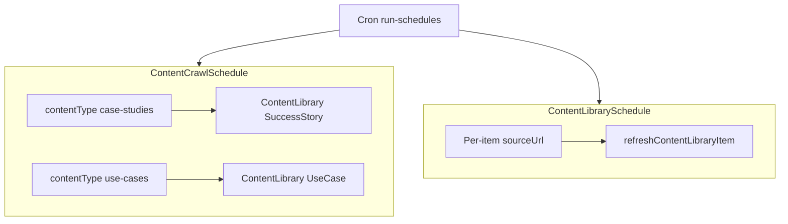

# StradexAI.com + AgentPilot content alignment

## Goals

- **StradexAI.com** — Marketing site selling **growth marketing services** (positioning, proof, events, CTAs).
- **AgentPilot** — Uses that content for **GTM outreach** via Content Library RAG + `[buildContentContext](lib/content/build-content-context.ts)` (and related flows).
- **Site structure** should map cleanly to **ContentType** and to what `**[/api/cron/content-library/run-schedules](app/api/cron/content-library/run-schedules/route.ts)`** can refresh today.

## How AgentPilot sync works today (cron contract)

Vercel (or external) cron should call:

`GET /api/cron/content-library/run-schedules` with `Authorization: Bearer <CRON_SECRET>` (or `?secret=`).

Two mechanisms run in sequence:

| Mechanism         | Model                                            | `contentType` / trigger | Writes `ContentLibrary.type`  | Notes                                                                                                                            |
| ----------------- | ------------------------------------------------ | ----------------------- | ----------------------------- | -------------------------------------------------------------------------------------------------------------------------------- |
| **Product crawl** | `[ContentCrawlSchedule](prisma/schema.prisma)`   | `case-studies` only     | **SuccessStory**              | Firecrawl workflow `[crawlAndParseCaseStudies](lib/content-library/firecrawl-workflows.ts)`; optional `includePaths` JSON        |
| **Product crawl** | same                                             | `use-cases` only        | **UseCase**                   | `[importUseCasesFromUrl](lib/content-library/firecrawl-workflows.ts)`                                                            |
| **URL refresh**   | `[ContentLibrarySchedule](prisma/schema.prisma)` | tied to one library row | whatever that row’s `type` is | Re-fetches that item’s `**sourceUrl`** and re-ingests (good for single pages: event detail, framework article, PDF landing page) |

**Important:** Scheduled **listing crawls** are **product-linked** (`productId` required). In My Company you typically attach StradexAI “growth services” (or a named catalog product) so crawled items land under the right product for coverage/health UX.

**Not covered by the two crawl modes:** There is **no** cron mode named `events` or `frameworks` that batch-crawls those types. **CompanyEvent**, **Framework**, **Battlecard**, etc. enter the library via **manual wizard**, **upload/import**, or **one URL per item** + **ContentLibrarySchedule** refresh.

## Should the marketing site use tabs for case studies vs success stories vs events?

**Recommendation: optimize for buyers first, then map to AgentPilot.**

| Public marketing IA (suggested)             | Purpose                        | AgentPilot `ContentType`                | How it gets into AgentPilot                                                                                                                                                                                           |
| ------------------------------------------- | ------------------------------ | --------------------------------------- | --------------------------------------------------------------------------------------------------------------------------------------------------------------------------------------------------------------------- |
| **Services / Solutions** (or “How we work”) | Offer + methodology            | **Framework**, **UseCase** (supporting) | Use **use-cases** crawl pointing at a stable **/solutions** or **/use-cases** listing URL **or** manual library items + optional `ContentLibrarySchedule` on key pages                                                |
| **Proof** (single nav label)                | Case studies + outcomes        | **SuccessStory**                        | **case-studies** crawl → `SuccessStory`. Avoid a separate nav tab “Success stories” vs “Case studies” **unless** they are two different URLs you want two schedules for; both still become **SuccessStory** in the DB |
| **Events**                                  | Webinars, dinners, conferences | **CompanyEvent**                        | Usually **per event page**: import once or create library row with `sourceUrl` + **ContentLibrarySchedule** for date/agenda updates — **not** the batch `case-studies` / `use-cases` crawler                          |
| **Resources**                               | PDFs, one-pagers, security FAQ | **ResourceLink**, **UploadedDocument**  | Links: import URL or upload; refresh via **ContentLibrarySchedule** if the URL is canonical                                                                                                                           |
| **Compare / Why us**                        | vs agency, vs DIY AI           | **Battlecard**                          | Mostly **manual** or pasted import; optional refresh if each battlecard has a stable `sourceUrl`                                                                                                                      |

So: **one “Proof” section** on the site is usually enough; internally you can still label copy “success story” vs “case study” — AgentPilot stores both shapes under **SuccessStory** from the case-study crawler.

## StradexAI.com structure (concrete)

1. **Home** — Positioning, primary CTA (e.g. book scoping call), trust strip.
2. **Services** — Packages / managed growth execution; link to methodology (Framework-style messaging).
3. **Solutions or Use cases** — Problem-centric pages; URL used by `**use-cases`** crawl schedule (clear HTML, one story per logical block helps Firecrawl extraction).
4. **Proof** — Index + detail URLs; index or section URL used by `**case-studies`** crawl (`includePaths` if you need to limit to `/proof/` paths).
5. **Events** — Upcoming + past; each **upcoming** event worth mentioning in outreach should exist as a **CompanyEvent** row (import or API), with **ContentLibrarySchedule** if the page updates often.
6. **Resources** — Downloadables and links; match **ResourceLink** / uploads.
7. **Contact / Book** — Conversion; optional **ResourceLink** in library for the booking URL.

**LLM- and crawler-friendly:** Stable headings (`h1`/`h2`), semantic sections, one primary topic per URL, consistent patterns across case study templates (title, challenge, approach, outcome, quote). See [docs/CONTENT_LIBRARY_OUTLINE_STRADEXAI.md](docs/CONTENT_LIBRARY_OUTLINE_STRADEXAI.md) for copy themes.

## Vercel (marketing site)

- **StradexAI.com on Vercel** is appropriate (Next.js, Astro, or Framer-exported static + edge): fast global delivery, preview deployments for copy changes.
- **AgentPilot** stays the system of record for **library rows, embeddings, and cron**; the marketing site does **not** need direct DB access.
- Configure **Vercel Cron** (on the **AgentPilot** project, not necessarily StradexAI) to hit `run-schedules` on the chosen cadence; set `CRON_SECRET` in AgentPilot env.

## Optional follow-on (from prior plan)

A separate “content studio” or M2M API remains optional for **editing** library items without opening AgentPilot; it does not replace StradexAI as the **public** marketing site.

## References in repo

- Cron implementation: [app/api/cron/content-library/run-schedules/route.ts](app/api/cron/content-library/run-schedules/route.ts)
- Schema: `ContentCrawlSchedule.contentType` — `case-studies`  `use-cases` [prisma/schema.prisma](prisma/schema.prisma)
- StradexAI content outline: [docs/CONTENT_LIBRARY_OUTLINE_STRADEXAI.md](docs/CONTENT_LIBRARY_OUTLINE_STRADEXAI.md)
- Technical ingest overview: [docs/TECHNICAL_IMPLEMENTATION_GUIDE.md](docs/TECHNICAL_IMPLEMENTATION_GUIDE.md) §6.1

